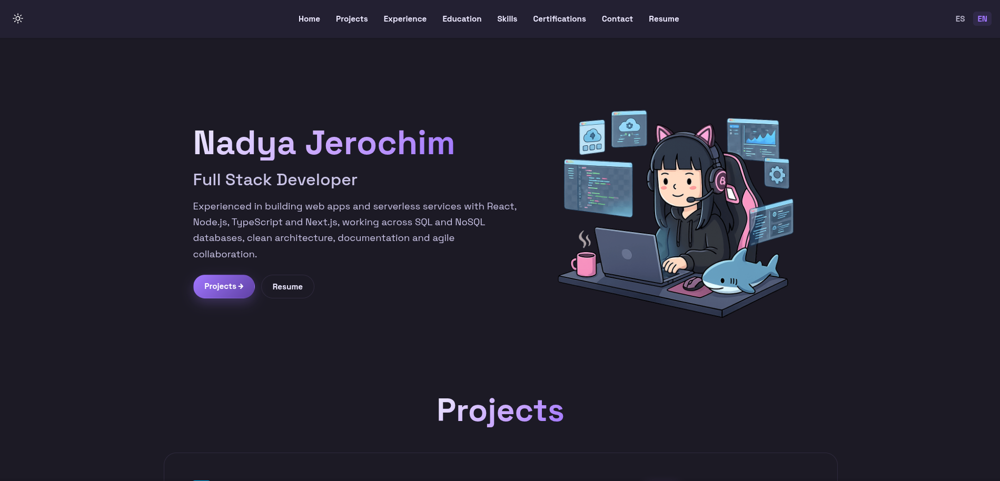
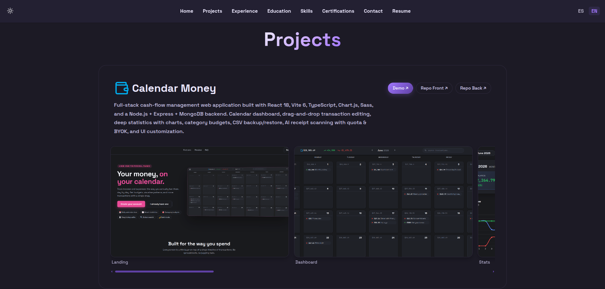
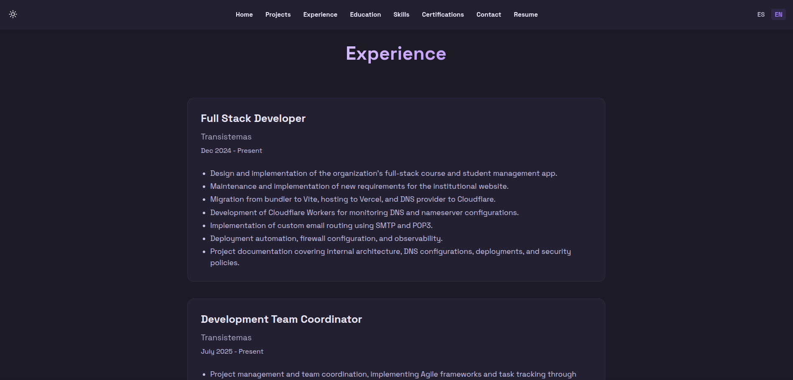

<h1 align="center"> nady4.com — Personal Portfolio </h1>

<p align="center">
Server-rendered personal portfolio and integrated Markdown blog. Built with Qwik + Qwik City, deployed on the edge via Vercel. Bilingual (EN/ES) and with dark mode.
</p>

<br>

## 📸 Screenshots

<table>
  <tr>
    <td colspan="2" align="center"><em>Hero</em></td>
  </tr>
  <tr>
    <td colspan="2" align="center"></td>
  </tr>
  <tr>
    <td align="center"><em>Projects gallery</em></td>
    <td align="center"><em>Experience</em></td>
  </tr>
  <tr>
    <td></td>
    <td></td>
  </tr>
</table>

<br>

## 🌐 Live site

- **URL:** <b><a href="https://nady4.com">nady4.com</a></b>

<br>

## ✨ Features

### 🏠 Portfolio

- **Hero section** with a short bio, role, primary CTA into the projects gallery, and a secondary "Download resume" button that picks the right CV per locale (`cv-en.pdf` / `cv-es.pdf`).
- **Navbar** with smooth-scroll anchors to Home, Experience, Education, Projects, Skills, Certifications and Contact — fully translated in EN/ES.
- **Experience timeline** rendered as bullet lists of role contributions, sourced from the translation file so both languages stay in sync.
- **Education block** with degree, institution, and year range.
- **Skills grid** with 8 categories (Languages, Frontend, Backend, Databases, DevOps, Testing, Tools, AI + Spoken Languages) — each rendered as a tag cloud.
- **Certifications list** (Full Stack, QA, UX, Scrum, English C2) shown as cards.
- **Contact section** with a direct `mailto:dev@nady4.com` link.
- **Footer** with name, email, and language-aware credits.

### 🖼️ Projects showcase

- **Per-project cards** with favicon, title, description, optional demo link, and one or more repo links.
- **Horizontal-scroll screenshot gallery** per project, with `‹` / `›` navigation buttons and lazy-loaded images.
- **Lightbox preview** — click any screenshot to open it full-screen, close with `×` or by clicking the backdrop.
- **Live data source** — remote screenshot URLs are inlined directly from each project's repo `public/` folder, so the gallery stays in sync with the deployed demos without re-committing binaries.
- **Four featured projects**: [Calendar Money](https://money.nady4.com) (full-stack cash-flow app), [NYADY](https://nyady.nady4.com) (e-commerce + MercadoPago + Zipnova), [Nya Store](https://nya.nady4.com) (Next.js 15 e-commerce), and [DS Invite](https://ds.transistemas.org) (Cloudflare Workers + Discord OAuth).

### ✍️ Markdown blog

- **Auto-discovered posts** in `src/content/blog/` — no manual registration needed. A custom Vite plugin in `vite-plugins/` walks the folder and exposes the content as the `virtual:blog-content` virtual module.
- **Per-post frontmatter** (`title`, `date`, `description`, `tags`) drives the index page and per-post SEO.
- **Rendered at build time** with `markdown-it`, so there is no runtime markdown parser in the client bundle.
- **Localized slugs and metadata** — the blog index and the post route both pull translations from the same `translations.ts` file the rest of the app uses.

### 🎨 Design & UX

- **Dark / light theme** with persistence in `localStorage` and a token-driven SCSS layer (CSS custom properties + SCSS variables that wrap them).
- **Bilingual out of the box** — language is resolved from `?lang=` first, then from the `Accept-Language` header, and exposed via `useTranslations()` / `useLocale()` route loaders.
- **Reduced motion-aware** — lightbox transitions, navbar scroll, and gallery scroll respect `prefers-reduced-motion`.
- **Accessible** — keyboard-friendly lightbox, semantic landmarks, focus rings, and ARIA labels on every icon-only button.

### 🔍 SEO & metadata

- **Per-route metadata** — every Qwik City route defines its own `head` (title, description, Open Graph, Twitter cards).
- **JSON-LD `Person` schema** in the root layout for rich-result eligibility.
- **Generated sitemap** at `/sitemap.xml`.
- **`robots.txt` and `manifest.json`** shipped from `public/`.

### ⚡ Performance

- **Edge SSR** with Qwik City + Vercel Edge Functions — sub-100 ms TTFB anywhere on the edge network.
- **Resumability over hydration** — almost zero client-side JS on first paint, thanks to Qwik's serialization model.
- **Zero runtime dependencies** — the production bundle ships only what is needed, on demand. A click on a link downloads the chunk for that route; nothing else.
- **Static-friendly assets** — favicon, manifest, CVs and screenshots are served as plain files; image elements set explicit `width`/`height` to prevent layout shift.

<br>

## 🛠️ Tech stack

| Area            | Technology                                                                         |
| --------------- | ---------------------------------------------------------------------------------- |
| Framework       | [Qwik](https://qwik.dev) + [Qwik City](https://qwik.dev/qwikcity/overview/)        |
| Build tool      | [Vite](https://vitejs.dev) `7.x`                                                   |
| Language        | TypeScript `5.4`                                                                   |
| Styling         | SCSS modules with CSS custom properties for theming                                |
| Content         | Markdown (`markdown-it`) loaded through a custom Vite virtual module               |
| Linting         | ESLint `9` (flat config)                                                           |
| Formatting      | Prettier `3`                                                                       |
| Deployment      | [Vercel Edge Functions](https://vercel.com/docs/concepts/functions/edge-functions) |
| Package manager | pnpm / bun (both lockfiles are committed)                                          |
| Edge runtime    | Vercel Edge + Qwik City SSR                                                        |

<br>

## 🏗️ Architecture

```
portfolio/                  # This repo
├── adapters/
│   └── vercel-edge/        # Vercel Edge adapter config
├── public/                 # Static assets (CVs, favicon, screenshots)
│   ├── 1.png / 2.png / 3.png   # README screenshots
│   ├── cv-en.pdf / cv-es.pdf   # Bilingual resume
│   ├── dev.png                 # Hero illustration
│   ├── favicon.svg
│   ├── manifest.json
│   ├── projects/               # Project favicons
│   └── robots.txt
├── src/
│   ├── assets/             # Images and SVGs imported as URLs
│   ├── components/         # Hero, Navbar, Projects, Experience, Education,
│   │                        # Skills, Certifications, Contact, Footer, RouterHead
│   ├── content/blog/       # Markdown posts (auto-discovered)
│   ├── lib/                # Translations, blog helpers
│   ├── routes/             # Qwik City file-based routes
│   │   ├── blog/
│   │   │   ├── [slug]/     # Dynamic post route
│   │   │   └── index.tsx   # Blog index
│   │   ├── sitemap.xml/    # Generated sitemap endpoint
│   │   ├── index.tsx       # Landing page
│   │   └── layout.tsx      # Root layout, i18n + SEO + theme
│   ├── styles/             # Component-scoped SCSS files
│   ├── types/              # Shared TypeScript types
│   ├── entry.dev.tsx
│   ├── entry.preview.tsx
│   ├── entry.ssr.tsx
│   ├── entry.vercel-edge.tsx
│   ├── global.css
│   └── root.tsx
├── vite-plugins/           # Custom Vite plugin for blog content
├── vercel.json             # Edge caching headers
├── vite.config.ts          # Vite + Qwik City config
├── eslint.config.js
├── tsconfig.json
└── package.json
```

### 🔍 Notable implementation details

- **Vite virtual module for blog content** — a tiny custom plugin in `vite-plugins/` walks `src/content/blog/` at build time, parses frontmatter + body with `markdown-it`, and exposes the result as `virtual:blog-content`. Routes import from the virtual module, so adding a `.md` file is enough to publish a new post.
- **i18n resolved at request time** — `src/routes/layout.tsx` checks `?lang=` first, then the `Accept-Language` header, then falls back to English. The chosen locale is exposed through `useLocale()` and `useTranslations()` route loaders so any component can read strings without prop-drilling.
- **SCSS tokens as CSS custom properties** — colors, borders, shadows, radii, and font sizes are defined once in CSS variables on `:root` (and overridden for the light theme). SCSS variables wrap them via `var(...)`, so every component automatically responds to theme switches.
- **Image preloading** — the hero `` and the project gallery thumbnails all set explicit `width`/`height` and `loading="lazy"` (when below the fold) to keep CLS at 0.
- **SEO head** — `src/components/RouterHead.tsx` builds a `<DocumentHead>` value for every route, including Open Graph, Twitter cards, canonical URL, and the JSON-LD `Person` blob injected by the root layout.

<br>

## 🚀 Getting started

### 📋 Prerequisites

- Node.js `^18.17.0 || ^20.3.0 || >=21.0.0`
- pnpm, npm, or bun

### 📦 Installation

```sh
# 📥 Clone the repository
git clone https://github.com/nady4/portfolio

# 📂 Move to the project folder
cd portfolio

# 📦 Install dependencies (pnpm, npm or bun)
pnpm install
# or: npm install
# or: bun install
```

### 💻 Run the dev server

```sh
pnpm dev
# or: npm run dev
# or: bun run dev
```

The app starts on `http://localhost:5173`.

> During dev, Vite will request a large number of `.js` files. That is normal — it does not represent a Qwik production build.

### 🏗️ Build for production

```sh
pnpm build
# or: npm run build
```

This runs the client bundle, a TypeScript type-check, and the Vercel Edge server bundle.

### 🔍 Preview the production build

```sh
pnpm preview
# or: npm run preview
```

### 🧹 Lint and format

```sh
pnpm lint          # ESLint
pnpm fmt           # Prettier write
pnpm fmt.check     # Prettier check (CI-friendly)
```

<br>

## 📜 Scripts

| Command          | Description                                          |
| ---------------- | ---------------------------------------------------- |
| `pnpm dev`       | Start the dev server (Vite SSR mode with hot reload) |
| `pnpm build`     | Build for production (client + types + edge server)  |
| `pnpm preview`   | Build and serve a local production preview           |
| `pnpm lint`      | Run ESLint on `src/**/*.ts*`                         |
| `pnpm fmt`       | Format the codebase with Prettier                    |
| `pnpm fmt.check` | Check formatting with Prettier (CI-friendly)         |
| `pnpm deploy`    | Deploy to Vercel via the CLI                         |

<br>

## 📝 Content

### ✍️ Adding a blog post

Create a new Markdown file in `src/content/blog/`:

```markdown
---
title: My new post
date: 2026-01-15
description: Short summary used for SEO and previews.
tags: [qwik, typescript]
---

# Hello

Body in **Markdown** — rendered with `markdown-it` at build time.
```

Posts are picked up automatically by the custom Vite plugin in `vite-plugins/` and exposed as the `virtual:blog-content` module. No manual registration is required.

### 🧩 Adding a project

Projects live as a typed array inside `src/components/Projects.tsx`. Add a new entry with `favicon`, `name`, a translation key for the description, optional `demo` link, `repos`, and a list of `shots` (image `src` + `alt`). Remote screenshots are inlined directly from the source repo's `public/` folder, so they stay in sync with the deployed demos.

<br>

## 🌐 Internationalization

Translations are stored in `src/lib/translations.ts` and selected per request in `src/routes/layout.tsx`:

1. `?lang=es` or `?lang=en` in the URL takes precedence.
2. Otherwise, the `Accept-Language` header is inspected.
3. The result is exposed to components through the `useTranslations()` and `useLocale()` route loaders.

To add a new language, extend the `translations` object and the `useLocale` resolver.

<br>

## 🚢 Deployment

The site is configured for [Vercel Edge Functions](https://vercel.com/docs/concepts/functions/edge-functions). Pushing to the default branch triggers a production build, and `pnpm deploy` can be used for ad-hoc previews from the CLI.

Caching headers in `vercel.json`:

| Path                    | Policy                                                   |
| ----------------------- | -------------------------------------------------------- |
| `/service-worker.js`    | `public, max-age=0, must-revalidate`                     |
| `/assets/*`, `/build/*` | `public, max-age=31536000, s-maxage=31536000, immutable` |

<br>

## 📝 Notes

- The Vercel Edge adapter in `adapters/vercel-edge/` is the only deploy target that's exercised; the other `entry.*.tsx` files exist to support other runtimes (dev, preview, custom server) without touching the build graph.
- All CVs, blog posts, and images under `public/` are reserved content. Source code is MIT; see the License section below.
- The screenshots in the README and on the live site are taken against the production build — if you change a section's layout, refresh the corresponding `public/*.png` to keep the gallery in sync.

<br>

## 📜 License

- **Source code:** released under the [MIT License](https://opensource.org/licenses/MIT).
- **Content** (resume PDFs, blog posts, project descriptions, images under `public/`): All rights reserved. Please ask before reproducing.

<br>

## 📬 Contact

### 💌 Email: **dev@nady4.com**

### 💼 LinkedIn: [nady4](https://www.linkedin.com/in/nady4)

### 👩🏻‍💻 GitHub: [@nady4](https://github.com/nady4)
