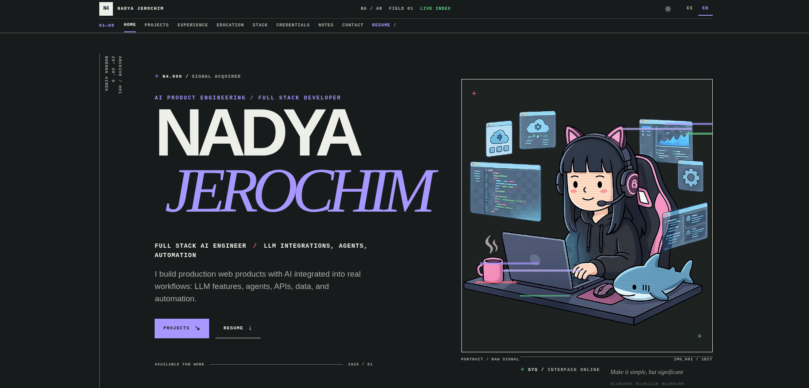
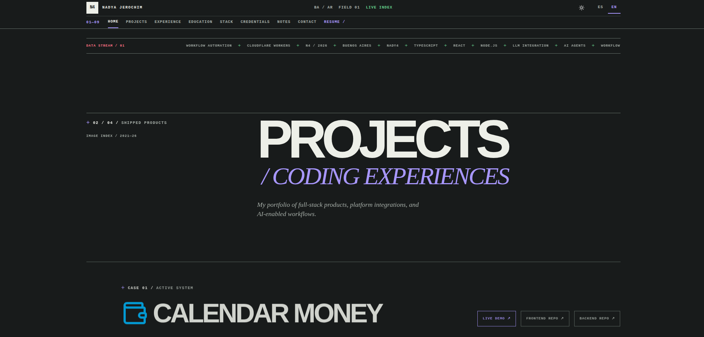
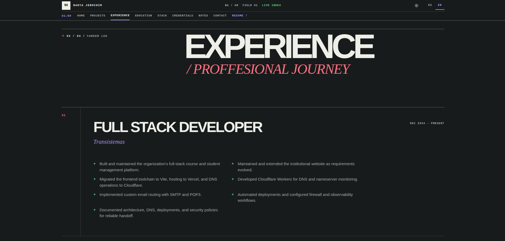
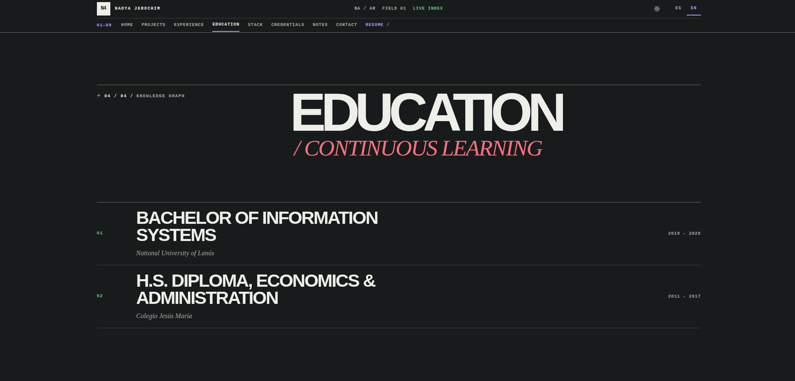
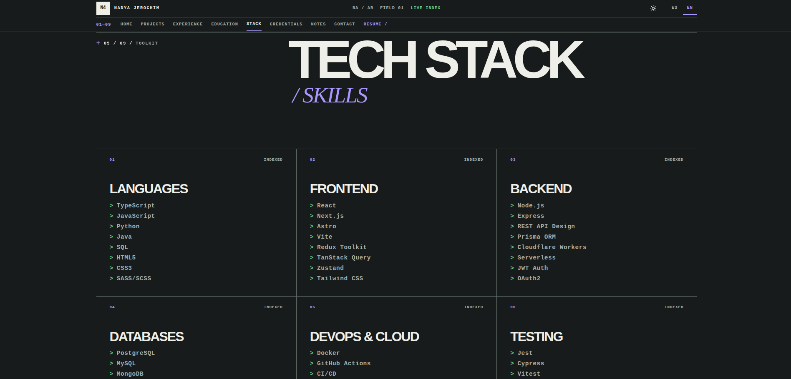
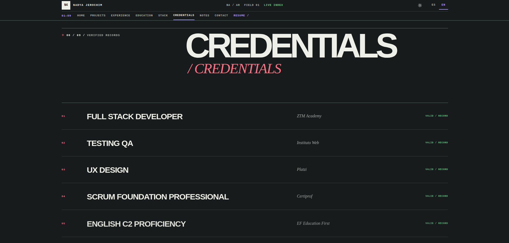
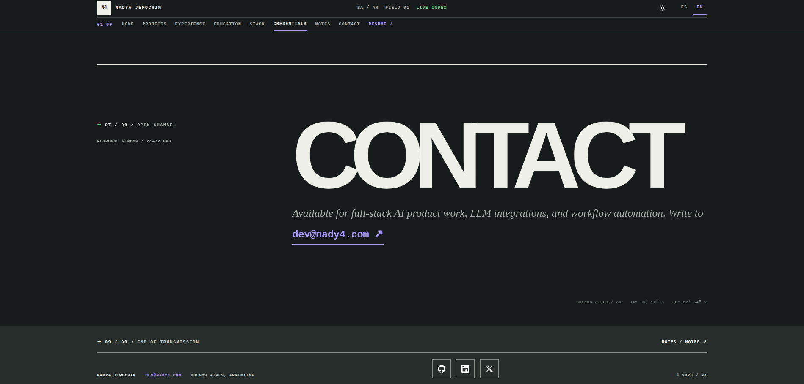

<h1 align="center"><a href="https://nady4.com">nady4.com</h1></a>

<p align="center">
🚀 Server-rendered personal portfolio with an integrated Markdown-powered blog. Built with Qwik and Qwik City, deployed on Vercel Edge, featuring bilingual (EN/ES) support and dark mode.
</p>

<br>

## 📸 Screenshots

<p align="center"></p>

<p align="center"></p>

<p align="center"></p>

<p align="center"></p>

<p align="center"></p>

<p align="center"></p>

<p align="center"></p>

<br>

## ✨ Features

### 🏠 Portfolio

- **Hero section** positioning Nadya as a Full Stack Engineer who ships AI features inside real products, with a primary CTA into the projects archive and a secondary resume download that picks the right CV per locale (`cv-en.pdf` / `cv-es.pdf`).
- **Navbar** with smooth-scroll anchors to Home, Experience, Education, Projects, Stack, Credentials, Blog and Contact — fully translated in EN/ES.
- **Data stream** with a single technical marquee for LLM integration, AI agents, workflow automation, TypeScript, React, and Cloudflare Workers.
- **Experience ledger** rendered as dense role contribution lists, sourced from the translation file so both languages stay in sync.
- **Education block** with degree, institution, and year range.
- **Tech Stack grid** with 9 indexed categories covering languages, frontend, backend, databases, DevOps, testing, tools, AI applications, and spoken languages.
- **Credentials register** (Full Stack, QA, UX, Scrum, English C2) presented as an indexed ledger.
- **Contact section** with a direct `mailto:dev@nady4.com` link.
- **Footer** with name, email, social links, blog link, and high-contrast theme-aware tokens.

### 🖼️ Projects showcase

- **Indexed case files** with project favicon, title, description, optional demo link, and one or more repo links.
- **Horizontal-scroll screenshot gallery** per project, with `←` / `→` navigation buttons and lazy-loaded images.
- **Clean project imagery** — screenshots render without grayscale, contrast, scanline, displacement, scaling, or animation effects.
- **Lightbox preview** — click any screenshot to open it full-screen, close with `×` or by clicking the backdrop.
- **Keyboard support** — press `Escape` to close the screenshot lightbox.
- **Live data source** — remote screenshot URLs are inlined directly from each project's repo `public/` folder, so the gallery stays in sync with the deployed demos without re-committing binaries.
- **Four featured projects**: [Calendar Money](https://money.nady4.com) (full-stack cash-flow app), [NYADY](https://nyady.nady4.com) (e-commerce + MercadoPago + Zipnova), [Nya Store](https://nya.nady4.com) (Next.js 15 e-commerce), and [DS Invite](https://ds.transistemas.org) (Cloudflare Workers + Discord OAuth).

### ✍️ Markdown blog

- **Auto-discovered posts** in `src/content/blog/` — no manual registration needed. A custom Vite plugin in `vite-plugins/` walks the folder and exposes the content as the `virtual:blog-content` virtual module.
- **Per-post frontmatter** (`title`, `date`, `description`, `tags`) drives the index page and per-post SEO.
- **Rendered at build time** with `markdown-it`, so there is no runtime markdown parser in the client bundle.
- **Localized interface and metadata** — blog navigation, descriptions, fallbacks, and route metadata are localized in EN/ES while Markdown posts remain content-managed files.

### 📰 Newsletter

- **Signup form on every blog surface** — a shared `Newsletter` component renders at the bottom of the blog index and each post, in both languages, styled as an archive plate consistent with the design system.
- **Validated end-to-end** — client-side HTML5 `type="email"` + regex check first, then a second validation pass server-side in the API route before anything touches storage.
- **Stored in Upstash Redis** — the endpoint writes to the `newsletter:subscribers` set via Upstash's REST API (`SADD`), so duplicates are silently ignored and emails are normalized to lowercase.
- **Editorial status feedback** — a live `aria-live` status line reports success (green trace), invalid address, or transmission failure (red fragment), matching the site's artifact language.
- **Zero SDK dependency** — the endpoint calls Upstash's REST API with a single `fetch` and the `KV_REST_API_*` env vars, avoiding a deprecated `@vercel/kv` dependency.

### 🎨 Design & UX

- **Dark-first theme** with explicit light mode, persistence in `localStorage`, and a token-driven SCSS layer (CSS custom properties + SCSS variables that wrap them).
- **Industrial editorial design system** using off-black/off-white substrates, electric purple signals, green/red status artifacts, square geometry, technical labels, and asymmetric archive layouts.
- **Bilingual out of the box** — language is resolved from `?lang=` first, then from the `Accept-Language` header, and exposed via `useTranslations()` / `useLocale()` route loaders.
- **Responsive by design** — mobile layouts explicitly collapse grids, keep screenshot tracks touch-scrollable, wrap long project names, and preserve 44×44 interaction targets.
- **Reduced motion-aware** — reveals, lightbox transitions, data stream motion, and gallery scrolling respect `prefers-reduced-motion`.
- **Accessible** — keyboard-friendly lightbox, semantic landmarks, focus rings, and ARIA labels on every icon-only button.

### 🔍 SEO & metadata

- **Per-route metadata** — every Qwik City route defines its own `head` (title, description, Open Graph, Twitter cards, `og:locale` / `og:locale:alternate`).
- **Single canonical per page** — the dynamic canonical is generated in `src/components/RouterHead.tsx` from the request URL (query params stripped). No per-route canonical is duplicated.
- **Hreflang for both languages** — every page emits `hreflang="en"`, `hreflang="es"` and `hreflang="x-default"` link alternates pointing to the path-prefixed counterparts (`/`, `/es/`).
- **Path-prefixed i18n** — the Spanish version of every page lives at `/es/…` (e.g. `/es/`, `/es/blog/`, `/es/blog/[slug]/`). The locale is resolved from `url.pathname` in `src/routes/layout.tsx`, with `?lang=` and `Accept-Language` as fallbacks. The language switcher in the Navbar swaps the path prefix instead of appending a query param.
- **Reactive `<html lang>`** — `src/entry.ssr.tsx` reads the request URL from `serverData.url` and sets the SSR `containerAttributes.lang` to `"es"` or `"en"` accordingly. The `<body lang>` in `src/root.tsx` is set from the `useLocale` route loader so the client tree stays in sync.
- **Multi-block JSON-LD** — `src/components/JsonLd.tsx` injects a `Person`, a `WebSite`, a `ProfessionalService`, and a `WebPage` (or `BlogPosting` for posts) directly as `<script type="application/ld+json">` tags. The Person block references AI product engineering, LLM application development, agents, orchestration, API integration, databases, `worksFor`, `alumniOf`, `hasCredential`, `address`, and `sameAs`.
- **Semantic heading hierarchy** — each route has its own page heading and section headings use `<h2>` with item headings at `<h3>`.
- **AI positioning metadata** — titles, descriptions, Open Graph, Twitter cards, JSON-LD, `manifest.json`, and `llms.txt` consistently use the Full Stack Engineer positioning.
- **Inline styles removed** — component styling stays in SCSS files; Markdown callouts use the `.callout` class in `src/styles/Post.scss`.
- **Mobile tap targets** — the dark-mode toggle in `Navbar` and the gallery nav arrows in `Projects` are sized to a 44×44 minimum hit area.
- **Generated sitemap** at `/sitemap.xml` — every static URL and every blog post has both English and Spanish entries, each with `<xhtml:link rel="alternate">` hreflang alternates. Cache header `s-maxage=3600`.
- **`llms.txt`** at `/llms.txt` — entity description for LLM crawlers, generated per the emerging `llms.txt` spec, including the sitemap reference at the bottom.
- **`robots.txt`** declares the canonical host and the sitemap URL.
- **Favicon** — `public/favicon.svg` and regenerated `public/favicon.ico` both use the navbar's `N4` logo mark.
- **Email deliverability (DNS)** — recommended (must be set at the DNS provider, not in this repo): an SPF record at the apex of `nady4.com` and a DMARC record at `_dmarc.nady4.com`. See the _Link Building & off-page_ section below for the exact records.
- **Performance hints** — system font stacks avoid external font requests, `fetchpriority="high"` is set on the hero image, below-the-fold images are lazy-loaded, and every image has explicit dimensions to reduce CLS.
- **Out of scope (intentional)** — YouTube and Facebook are not linked (intentionally absent per the owner's social-media strategy). Analytics (Plausible / Umami / GA4) is not yet installed; once picked, it can be added to `src/components/RouterHead.tsx` via `useDocumentHead` scripts.

### ⚡ Performance

- **Edge SSR** with Qwik City + Vercel Edge Functions — sub-100 ms TTFB anywhere on the edge network.
- **Resumability over hydration** — almost zero client-side JS on first paint, thanks to Qwik's serialization model.
- **Zero runtime dependencies** — the production bundle ships only what is needed, on demand. A click on a link downloads the chunk for that route; nothing else.
- **Static-friendly assets** — favicon, manifest, CVs and screenshots are served as plain files; image elements set explicit `width`/`height` to prevent layout shift.

<br>

## 🛠️ Tech stack

| Area            | Technology                                                                                  |
| --------------- | ------------------------------------------------------------------------------------------- |
| Framework       | [Qwik](https://qwik.dev) + [Qwik City](https://qwik.dev/qwikcity/overview/)                 |
| Build tool      | [Vite](https://vitejs.dev) `7.x`                                                            |
| Language        | TypeScript `5.4`                                                                            |
| Styling         | Component SCSS stylesheets with CSS custom properties for theming                           |
| Content         | Markdown (`markdown-it`) loaded through a custom Vite virtual module                        |
| Linting         | ESLint `9` (flat config)                                                                    |
| Formatting      | Prettier `3`                                                                                |
| Deployment      | [Vercel Edge Functions](https://vercel.com/docs/concepts/functions/edge-functions)          |
| Storage         | [Upstash Redis](https://upstash.com) via REST API (`KV_REST_API_URL` / `KV_REST_API_TOKEN`) |
| Package manager | pnpm / bun (both lockfiles are committed)                                                   |
| Edge runtime    | Vercel Edge + Qwik City SSR                                                                 |

<br>

## 🏗️ Architecture

```
portfolio/                  # This repo
├── adapters/
│   └── vercel-edge/        # Vercel Edge adapter config
├── public/                 # Static assets (CVs, favicon, screenshots)
│   ├── 1.png / 2.png / 3.png   # README screenshots
│   ├── cv-en.pdf / cv-es.pdf   # Bilingual resume
│   ├── dev.png                 # Hero illustration
│   ├── favicon.svg / favicon.ico # N4 navbar mark
│   ├── llms.txt
│   ├── manifest.json
│   ├── projects/               # Project favicons
│   └── robots.txt
├── src/
│   ├── assets/             # Images and SVGs imported as URLs
│   ├── components/         # Hero, DataStream, Signal, Navbar, Projects,
│   │                        # Experience, Education, Skills, Credentials, Contact,
│   │                        # Footer, RouterHead, Newsletter
│   ├── content/blog/       # Markdown posts (auto-discovered)
│   ├── lib/                # Translations, blog helpers
│   ├── routes/             # Qwik City file-based routes
│   │   ├── api/newsletter/ # Newsletter signup endpoint (Upstash Redis)
│   │   ├── blog/
│   │   │   ├── [slug]/     # Dynamic post route
│   │   │   └── index.tsx   # Blog index
│   │   ├── sitemap.xml/    # Generated sitemap endpoint
│   │   ├── index.tsx       # Landing page
│   │   └── layout.tsx      # Root layout, i18n + SEO + dark-first theme
│   ├── styles/             # Component-scoped SCSS files
│   ├── types/              # Shared TypeScript types
│   ├── entry.dev.tsx
│   ├── entry.preview.tsx
│   ├── entry.ssr.tsx
│   ├── entry.vercel-edge.tsx
│   ├── global.css          # Theme tokens, focus states, motion primitives
│   └── root.tsx
├── vite-plugins/           # Custom Vite plugin for blog content
├── vercel.json             # Edge caching headers
├── vite.config.ts          # Vite + Qwik City config
├── eslint.config.js
├── tsconfig.json
└── package.json
```

### 🔍 Notable implementation details

- **Vite virtual module for blog content** — a tiny custom plugin in `vite-plugins/` walks `src/content/blog/` at build time, parses frontmatter + body with `markdown-it`, and exposes the result as `virtual:blog-content`. Routes import from the virtual module, so adding a `.md` file is enough to publish a new post.
- **Newsletter signup** — `src/routes/api/newsletter/index.ts` validates the email server-side and persists it into the `newsletter:subscribers` set on Upstash Redis via a single REST `fetch` (`SADD`). The form component lives in `src/components/Newsletter.tsx` and is rendered below the feed and below every post in both languages. Subscribers can be exported anytime with a `SMEMBERS` call or the Upstash console's data browser.
- **i18n resolved at request time** — `src/routes/layout.tsx` checks `?lang=` first, then the `Accept-Language` header, then falls back to English. The chosen locale is exposed through `useLocale()` and `useTranslations()` route loaders so any component can read strings without prop-drilling.
- **Dark-first theme initialization** — `src/root.tsx` applies the persisted light theme before paint when selected; otherwise dark mode is used by default. `Navbar` synchronizes its signal with the document theme before interaction.
- **SCSS tokens as CSS custom properties** — colors, borders, footer contrast, and typography are defined once in CSS variables on `:root` (dark) and overridden under `[data-theme="light"]`. SCSS variables wrap them via `var(...)`, so every component responds to theme switches.
- **Image treatment** — the hero keeps its editorial scanlines and border treatment, while project screenshots remain clean and unfiltered. The hero `` and project gallery images use explicit dimensions; gallery images are lazy-loaded below the fold.
- **Reusable editorial primitives** — `Signal` provides technical labels and `DataStream` provides the single controlled marquee used between the hero and project archive.
- **SEO head** — `src/components/RouterHead.tsx` builds a `<DocumentHead>` value for every route, including Open Graph, Twitter cards, canonical URL, and the JSON-LD blocks injected by the root layout.

<br>

## 🚀 Getting started

### 📋 Prerequisites

- Node.js `^18.17.0 || ^20.3.0 || >=21.0.0`
- pnpm, npm, or bun

### 📦 Installation

```sh
# 📥 Clone the repository
git clone https://github.com/nady4/portfolio

# 📂 Move to the project folder
cd portfolio

# 📦 Install dependencies (pnpm, npm or bun)
pnpm install
# or: npm install
# or: bun install
```

### 📧 Newsletter storage

The newsletter signup persists subscribers to an Upstash Redis store through its REST API. Create a store (Vercel Marketplace → Upstash for Redis, connected to this project) and copy its REST credentials into `.env` (already gitignored) for local development — on Vercel they are injected automatically by the integration:

```sh
KV_REST_API_URL="https://your-store-name.upstash.io"
KV_REST_API_TOKEN="your-rest-token"
```

Subscribers accumulate in the `newsletter:subscribers` set; read them anytime with `SMEMBERS newsletter:subscribers` or the Upstash console's data browser.

### 💻 Run the dev server

```sh
pnpm dev
# or: npm run dev
# or: bun run dev
```

The app starts on `http://localhost:5173`.

> During dev, Vite will request a large number of `.js` files. That is normal — it does not represent a Qwik production build.

### 🏗️ Build for production

```sh
pnpm build
# or: npm run build
```

This runs the client bundle, a TypeScript type-check, and the Vercel Edge server bundle.

### 🔍 Preview the production build

```sh
pnpm preview
# or: npm run preview
```

### 🧹 Lint and format

```sh
pnpm lint          # ESLint
pnpm fmt           # Prettier write
pnpm fmt.check     # Prettier check (CI-friendly)
```

<br>

## 📜 Scripts

| Command          | Description                                          |
| ---------------- | ---------------------------------------------------- |
| `pnpm dev`       | Start the dev server (Vite SSR mode with hot reload) |
| `pnpm build`     | Build for production (client + types + edge server)  |
| `pnpm preview`   | Build and serve a local production preview           |
| `pnpm lint`      | Run ESLint on `src/**/*.ts*`                         |
| `pnpm fmt`       | Format the codebase with Prettier                    |
| `pnpm fmt.check` | Check formatting with Prettier (CI-friendly)         |
| `pnpm deploy`    | Deploy to Vercel via the CLI                         |

<br>

## 📝 Content

### ✍️ Adding a blog post

Create a new Markdown file in `src/content/blog/`:

```markdown
---
title: My new post
date: 2026-01-15
description: Short summary used for SEO and previews.
tags: [qwik, typescript]
---

# Hello

Body in **Markdown** — rendered with `markdown-it` at build time.
```

Posts are picked up automatically by the custom Vite plugin in `vite-plugins/` and exposed as the `virtual:blog-content` module. No manual registration is required.

### 🧩 Adding a project

Projects live as a typed array inside `src/components/Projects.tsx`. Add a new entry with `favicon`, `name`, a translation key for the description, optional `demo` link, `repos`, and a list of `shots` (image `src` + `alt`). Remote screenshots are inlined directly from the source repo's `public/` folder, so they stay in sync with the deployed demos.

<br>

## 🌐 Internationalization

Translations are stored in `src/lib/translations.ts` and selected per request in `src/routes/layout.tsx`:

1. `?lang=es` or `?lang=en` in the URL takes precedence.
2. Otherwise, the `Accept-Language` header is inspected.
3. The result is exposed to components through the `useTranslations()` and `useLocale()` route loaders.

To add a new language, extend the `translations` object and the `useLocale` resolver.

<br>

## 🚢 Deployment

The site is configured for [Vercel Edge Functions](https://vercel.com/docs/concepts/functions/edge-functions). Pushing to the default branch triggers a production build, and `pnpm deploy` can be used for ad-hoc previews from the CLI. The Upstash Redis store connected via the Vercel Marketplace injects the `KV_REST_API_URL` / `KV_REST_API_TOKEN` variables into every environment automatically.

Caching headers in `vercel.json`:

| Path                    | Policy                                                   |
| ----------------------- | -------------------------------------------------------- |
| `/service-worker.js`    | `public, max-age=0, must-revalidate`                     |
| `/assets/*`, `/build/*` | `public, max-age=31536000, s-maxage=31536000, immutable` |

<br>

## 📜 License

- **Source code:** released under the [MIT License](https://opensource.org/licenses/MIT).
- **Content** (resume PDFs, blog posts, project descriptions, images under `public/`): All rights reserved. Please ask before reproducing.

<br>

## 📬 Contact

### 💌 Email: **dev@nady4.com**

### 💼 LinkedIn: [nady4](https://www.linkedin.com/in/nady4)

### 👩🏻‍💻 GitHub: [@nady4](https://github.com/nady4)
